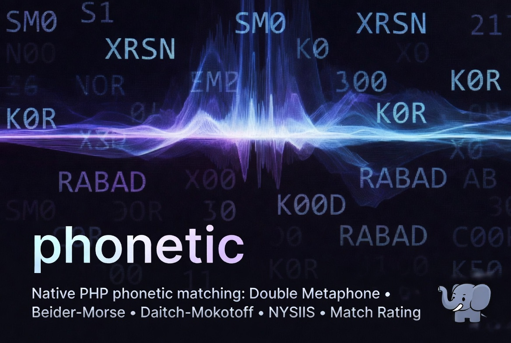

# phonetic

Native phonetic matching for PHP: **Double Metaphone**, **Beider-Morse Phonetic Matching (BMPM)**, **Daitch-Mokotoff Soundex**, **NYSIIS**, and **Match Rating Approach**, the phonetic name-matching encoders that PHP core does not ship. It also ships comparison helpers that answer "do these two names sound alike?" directly.

PHP core has `soundex()` and `metaphone()`, but not these, which are the standard tools for fuzzy name matching, record linkage, and genealogy search across spelling and transliteration variants.



## Quick Start

Install via [PIE](https://github.com/php/pie) (requires PHP 8.1 or later):

```sh
pie install iliaal/phonetic
```

Then ask whether two names sound alike, no userland matching logic required:

```php
double_metaphone_match("Catherine", "Kathryn");   // 2  (strong match)
dm_soundex_match("Moskowitz", "Moskovitz");        // true
bmpm_match("Peterson", "Petersen");                // true
```

## Choosing an algorithm

| | Double Metaphone | BMPM | Daitch-Mokotoff Soundex | NYSIIS | Match Rating |
|---|---|---|---|---|---|
| Output | primary + alternate key | language-aware token set | distinct 6-digit codes | single key | compact codex |
| Two names match when | keys are equal | token sets intersect | code sets intersect | keys are equal | clear the MRA similarity threshold |
| Strongest for | English and general Latin-script names | cross-language and transliteration variants (Slavic, Germanic, Hebrew, Romance) | Eastern-European and Ashkenazi surnames, genealogy | American/English surnames | English names; ships its own similarity test |
| Spelling-variant recall | good | highest | high, within its language model | good | good |
| Ambiguity handling | up to 2 keys | many tokens | multiple codes | single key | single codex |
| Relative speed | fast (1.0x) | slowest (~60x) | middle (~2.3x) | fast (0.42x) | fastest (0.24x) |
| Data source | clean-room published algorithm | Apache Commons Codec rule data | Apache Commons Codec rule data | clean-room published algorithm | clean-room published algorithm |

Rule of thumb: reach for Double Metaphone as a fast general-purpose default, BMPM when names cross languages or scripts, and Daitch-Mokotoff for Eastern-European and Jewish genealogy where it is the field standard. **NYSIIS** and **Match Rating Approach** are lighter, single-key English/American encoders, useful as alternate index keys or a second opinion alongside Double Metaphone.

## API

### Double Metaphone

Primary + alternate phonetic keys (Lawrence Philips). Clean-room implementation.

```php
double_metaphone(string $string, int $max_length = 4): array

double_metaphone("Schwarzenegger");        // ['primary' => 'XRSN', 'alternate' => 'XFRT']
double_metaphone("Smith");                 // ['primary' => 'SM0',  'alternate' => 'XMT']
double_metaphone("Catherine", 3);          // ['primary' => 'K0R',  'alternate' => 'KTR']
```

`alternate` equals `primary` when the algorithm produced no alternate branch. `max_length` caps each key (default 4; `0` or negative = unlimited).

### Beider-Morse Phonetic Matching

Language-aware token set, joined by `|` (alternatives) and `-` (words). Matches Apache Commons Codec's default `BeiderMorseEncoder`.

```php
bmpm(string $string, int $name_type = BMPM_GENERIC, int $accuracy = BMPM_APPROX, string $language = ""): string

bmpm("Jackson");                           // "iakson|iaksun|...|zokson"
bmpm("Garcia", BMPM_SEPHARDIC, BMPM_EXACT);// "garsia|gartSa"
```

Empty `$language` auto-detects; pass a language name (e.g. `"russian"`) to force it. Constants: `BMPM_GENERIC`, `BMPM_ASHKENAZI`, `BMPM_SEPHARDIC`, `BMPM_APPROX`, `BMPM_EXACT`.

A forced language also applies to the split variants of prefixed names (`van Smith`, `d'Angelo`). Commons Codec re-detects the language inside its prefix branch, silently ignoring the forced set there; this extension deliberately diverges and keeps it forced.

### Daitch-Mokotoff Soundex

List of distinct 6-digit codes (the algorithm branches on ambiguous letters). Matches Apache Commons Codec's `DaitchMokotoffSoundex` in branching mode.

```php
dm_soundex(string $string): array

dm_soundex("Auerbach");                    // ['097400', '097500']
dm_soundex("Peters");                      // ['734000', '739400']
```

### NYSIIS

Single phonetic key (New York State Identification and Intelligence System), tuned for American/English surnames. Reimplementation of the published algorithm; matches Apache Commons Codec's `Nysiis`.

```php
nysiis(string $string, int $max_length = 6): string

nysiis("Larson");                          // "LARSAN"
nysiis("Larsen");                          // "LARSAN"  (same key)
nysiis("Macdonald", 0);                    // "MCDANALD"  (full, untruncated)
```

The classic algorithm truncates to 6 characters; `max_length = 0` (or negative) returns the full key.

### Match Rating Approach

Compact codex (Western Airlines, 1977). Pair it with its own similarity test instead of comparing codexes for equality.

```php
match_rating(string $string): string

match_rating("Smith");                     // "SMTH"
match_rating("Catherine");                 // "CTHRN"
```

Use `match_rating_compare()` (below) for the actual homophone decision. It applies the algorithm's length-and-rating rules that plain codex equality skips.

## Comparison helpers

Each encoder produces a different output shape, so "do these sound alike?" needs the right comparison per algorithm. These helpers encapsulate that, so you don't reimplement the set-intersection or match-strength logic in userland.

```php
// Double Metaphone: 2 = primary keys agree, 1 = an alternate crosses, 0 = no match
// (a word-final J emits a trailing space into the alternate code, per the
// published algorithm; compare codes as returned, don't trim them)
double_metaphone_match(string $a, string $b, int $max_length = 4): int
double_metaphone_match("Catherine", "Kathryn");          // 2
double_metaphone_match("Vagner", "Wagner");              // 1

// BMPM: true when the phoneme token sets intersect (same args as bmpm())
bmpm_match(string $a, string $b, int $name_type = BMPM_GENERIC, int $accuracy = BMPM_APPROX, string $language = ""): bool
bmpm_match("Moskowitz", "Moskovitz");                    // true

// Daitch-Mokotoff: true when the code sets intersect
dm_soundex_match(string $a, string $b): bool
dm_soundex_match("Moskowitz", "Moskovitz");              // true

// NYSIIS: true when the single keys are equal
nysiis_match(string $a, string $b, int $max_length = 6): bool
nysiis_match("Smith", "Schmit");                         // true (both SNAT)

// Match Rating Approach: true when the two names clear the MRA similarity threshold
match_rating_compare(string $a, string $b): bool
match_rating_compare("Catherine", "Kathryn");            // true
```

## Usage

For a one-off "do these sound alike?" check, use the comparison helpers directly. Each applies the correct per-algorithm logic:

```php
double_metaphone_match("Catherine", "Kathryn");   // 2 (strong)
dm_soundex_match("Moskowitz", "Moskovitz");       // true
bmpm_match("Peterson", "Petersen");               // true
match_rating_compare("Catherine", "Kathryn");     // true
```

For indexed lookup, encode once and store the key(s) with each record, then query by encoded value instead of re-encoding at search time. Double Metaphone gives one or two keys per name; Daitch-Mokotoff and BMPM give a set, so index every code. BMPM's token string separates alternatives with `|` and words with `-`:

```php
// Build a phonetic index, then look up by shared code
$index = [];
foreach ($records as $id => $name) {
    foreach (dm_soundex($name) as $code) {   // index every code in the set
        $index[$code][] = $id;
    }
}
$hits = $index[dm_soundex("Moskovitz")[0]] ?? [];

// Splitting a BMPM token string into its individual codes
$codes = preg_split('/[|-]/', bmpm("Peterson"));
```

## Performance

Single-name encode, warm, `-O2` non-ASan PHP 8.4 on one core, over a representative mix of 18 names (best of 5 trials). Absolute time scales with input length; the relative ordering is the stable part.

| encoder | per call | throughput | relative |
|---|---|---|---|
| `match_rating()` | ~0.043 µs | ~23M/sec | 0.24x |
| `nysiis()` | ~0.074 µs | ~13M/sec | 0.42x |
| `double_metaphone()` | ~0.18 µs | ~5.5M/sec | 1.0x |
| `dm_soundex()` | ~0.41 µs | ~2.4M/sec | ~2.3x slower |
| `bmpm()` | ~11 µs | ~91k/sec | ~60x slower |

Match Rating and NYSIIS are short single-key passes, so they're the cheapest. Double Metaphone is a single linear pass with a primary/alternate split. Daitch-Mokotoff branches on ambiguous letters and dedups the resulting codes; a first-byte rule index keeps it fast. BMPM is the heaviest: language detection, a main transliteration pass, and two final rule passes, expanding a Cartesian product of phoneme alternatives capped at 20 per word. When you know the language, passing an explicit `$language` skips auto-detection and can cut bmpm time several-fold, though the gain depends on the chosen language's ruleset. Choose BMPM for recall, not throughput.

The comparison helpers cost roughly two encodes plus a cheap compare:

| helper | per call | throughput |
|---|---|---|
| `match_rating_compare()` | ~0.11 µs | ~9M/sec |
| `nysiis_match()` | ~0.14 µs | ~7M/sec |
| `double_metaphone_match()` | ~0.26 µs | ~3.8M/sec |
| `dm_soundex_match()` | ~0.80 µs | ~1.3M/sec |
| `bmpm_match()` | ~22 µs | ~45k/sec |

For repeated lookups against a fixed corpus, encode once and index the keys (see [Usage](#usage)) rather than calling a helper per candidate pair.

## Notes & limitations

- Input is UTF-8. `bmpm()` and `dm_soundex()` fold accented Latin and lowercase both
  Latin and Cyrillic script before rule matching, so raw `Иванов` encodes correctly.
- **Greek-script input is a known limitation:** Greek capitals are not lowercased
  (the algorithm's context-sensitive final-sigma cannot be expressed by a point-wise
  case map), so pass Greek names already lowercased or romanized.
- `double_metaphone()` targets ASCII/Latin; non-letter bytes are skipped, matching
  Apache Commons Codec.
- `nysiis()` and `match_rating()` operate on ASCII letters; `match_rating()`
  also folds the Latin-1/Latin-Extended accent set the reference handles.
- `bmpm()`, `bmpm_match()`, `dm_soundex()`, and `dm_soundex_match()` reject
  input longer than 4096 bytes with a `ValueError`. Real names are far shorter;
  the cap bounds branch work and BMPM's multi-pass expansion on untrusted input.

## 🔗 Native PHP extensions

Companion native PHP extensions:

- **[php_excel](https://github.com/iliaal/php_excel)**: native Excel I/O via LibXL. 7-10× faster than PhpSpreadsheet, full XLS/XLSX with formulas, formatting, and styling.
- **[mdparser](https://github.com/iliaal/mdparser)**: native CommonMark + GFM markdown parser via md4c. 15-30× faster than pure-PHP libraries.
- **[php_clickhouse](https://github.com/iliaal/php_clickhouse)**: native ClickHouse client speaking the wire protocol directly. Picks up where SeasClick left off.
- **[pdo_duckdb](https://github.com/iliaal/pdo_duckdb)**: PDO driver for DuckDB, analytical SQL in your PHP stack.
- **[fastjson](https://github.com/iliaal/fastjson)**: drop-in faster `ext/json`, backed by yyjson. 6× encode, 2.7× decode, 5× validate.
- **[phpser](https://github.com/iliaal/phpser)**: decoder-optimized binary serializer for cache workloads. Faster than igbinary on packed numerics and DTO batches.
- **[fast_uuid](https://github.com/iliaal/fast_uuid)**: high-throughput UUID generation (v1/v4/v7), batched CSPRNG and SIMD hex formatter, ramsey-compatible API.
- **[fastchart](https://github.com/iliaal/fastchart)**: native chart-rendering extension. 38 chart types behind one fluent OO API, SVG-canonical with PNG/JPG/WebP and optional PDF output.
- **[statgrab](https://github.com/iliaal/statgrab)**: system statistics (CPU, memory, disk, network) via libstatgrab, no parsing /proc by hand.

## License

BSD 3-Clause (see [LICENSE](LICENSE)).

The Beider-Morse and Daitch-Mokotoff rule data is vendored from
[Apache Commons Codec](https://commons.apache.org/proper/commons-codec/) under
the Apache License 2.0; its notice is included in Section 2 of the LICENSE file.
Double Metaphone, NYSIIS, and Match Rating Approach are independent
implementations of their published algorithms, validated against (and
edge-case-aligned with) Apache Commons Codec as the parity-test oracle
(no third-party code or data).

---

[Follow @iliaa on X](https://x.com/iliaa) • [Blog](https://ilia.ws) • If this matched the names exact comparison missed, ⭐ star it!
